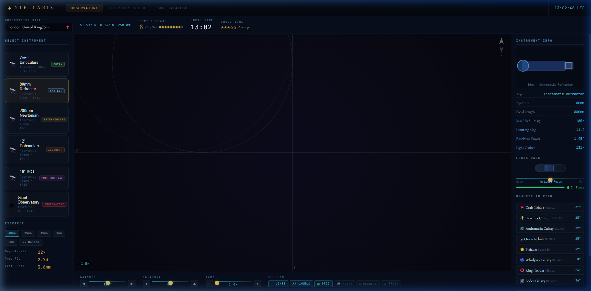
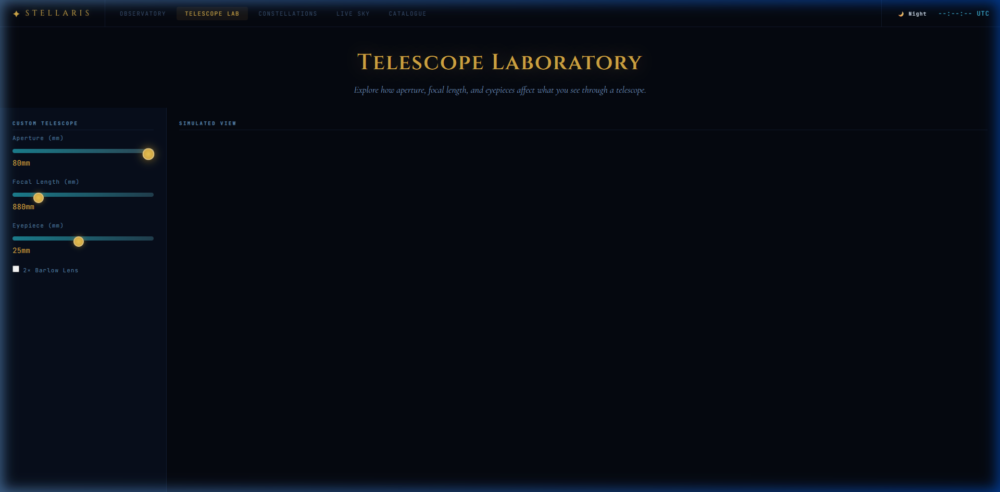

# Stellaris - A Virtual Sky to Observe



Stellaris is a browser-based virtual stargazing observatory built with vanilla HTML, CSS, and JavaScript. It combines an interactive observatory view, a full-screen sky map, a telescope lab, and a constellation encyclopedia in a single static site.

## Features

### Interactive Observatory
- Explore the sky from different observing locations.
- Adjust azimuth, altitude, focus, and zoom.
- View stars, planets, deep-sky objects, satellites, grids, and constellation overlays.
- Use telescope and eyepiece presets to simulate different observing setups.

### Full-Screen Sky Map
- Switch between azimuthal, stereographic, and all-sky projections.
- Inspect stars, planets, satellites, and deep-sky objects.
- Hover and select objects for live sky details.
- Jump from the sky map into the observatory view.

### Telescope Laboratory

- Compare aperture, focal length, eyepiece, and barlow combinations.
- See magnification, true field of view, exit pupil, limiting magnitude, and resolving power.
- Preview how different optical setups affect the observing experience.

### Constellations and Catalogue
- Search constellation cards and object listings.
- Review mythology, seasons, bright stars, and key features.
- Locate constellations and objects directly in the interactive views.

## Important Live/Local Note

Do not open `index.html` directly with `file://`.

This project should be served through a local or hosted HTTP server. Some external astronomy data and browser APIs behave differently or fail under direct file access because of cross-origin restrictions.

## Run Locally

Use any simple static file server, then open the provided localhost URL in a browser.

### Option 1: Node
```bash
npx serve .
```

### Option 2: Python
```bash
python -m http.server 8080
```

Then open:

- `http://localhost:3000` if using `serve`
- `http://localhost:8080` if using `python -m http.server`

## Recent Fixes

- Fixed a runtime crash in the observatory renderer caused by an undefined `nightFactor`.
- Fixed the Telescope Lab page so it no longer depends on private observatory state from another module.
- Fixed sky map to observatory navigation so object handoff updates the actual observatory state and redraws correctly.

## Project Structure

- `index.html`: Main application shell and section layout.
- `src/css/main.css`: Styling, layout, animations, and responsive behavior.
- `src/js/astronomy.js`: Astronomy calculations and catalog data.
- `src/js/skymap.js`: Full-screen sky map engine.
- `src/js/app-pages.js`: Telescope Lab and constellations page logic.
- `src/js/app.js`: Main observatory UI, interactions, and cross-page navigation.
- `tests/unit/runner.html`: Browser-based unit test runner.
- `tests/unit/astronomy.test.js`: Unit tests for the astronomy engine.

## Testing

At minimum, validate the JavaScript files for syntax and run the astronomy unit tests in a browser or a JS runtime harness.

## Deployment

Because this is a static site, it can be hosted on GitHub Pages, Netlify, Vercel static hosting, or any basic web server that serves HTML, CSS, and JavaScript files.

## Notes

This project is intended as an educational astronomy experience for stargazers and hobbyists.
